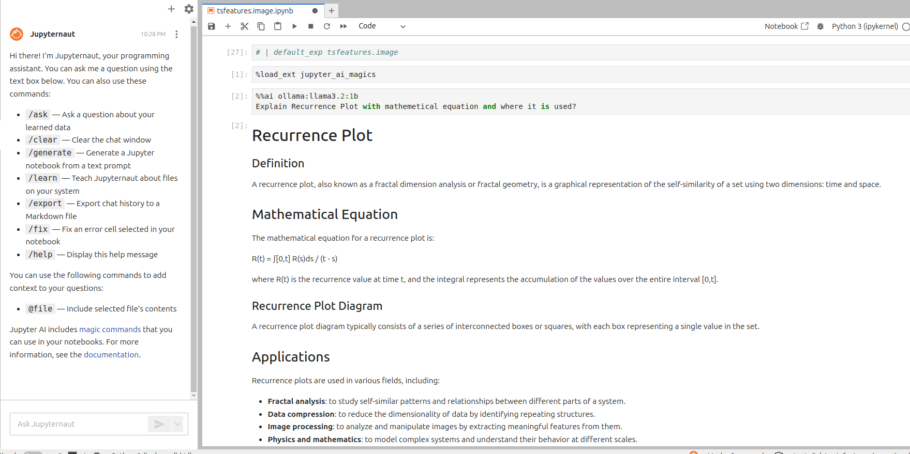

## Add LLM Capabilities to Jupyer

The one clear benefit other IDEs have over Jupyter is code autocompletion. Despite Jupyter's struggle in this regard, its other utilities make it perfect for writing data science codes. Adding a LLM-based capability to Jupyter enriches its functionality further. This README file serves as a guide on how to set up LLM capabilities in Jupyter Lab.

### How It Works

______________________________________________________________________

1. **Chat Interface**: Users can interact with Jupyter AI via a chat interface where they can ask questions or provide instructions related to their data analysis tasks. The system generates responses based on the provided information and user preferences.
2. **Code Rewriting with Comments**: Jupyter AI rewrites selected code snippets, adding comments to explain each part of the code for better readability and understanding.
3. **Notebook Generation from Prompt**: Users can create a new notebook by providing detailed descriptions or instructions through a text prompt. The system uses AI language models to populate the workbook with markdown and code cells, along with relevant content based on the input.
4. **Learning Local Files**: With the `/learn` command, Jupyternaut can learn about local files such as documentation or data sets. This allows for answering specific questions related to these files when prompted through the `/ask` command, utilizing embedding models and a vector database for efficient retrieval of information.
5. **Notebooks as Generative AI Playgrounds**: Users can run `%%ai cell magic` and `%ai line magic` commands in notebook cells or IPython command-line interface to interact with generative AI models. These commands support customization of output formats like HTML, math, source code, and images.
6. **Error Handling**: Jupyter AI includes an `Err` variable that captures errors during the execution of code. Users can use AI language models to explain and correct coding mistakes by interpolating the error into a prompt.

### Getting Started

______________________________________________________________________

1. Install the required packages:
   ```
   pip install "jupyter-ai[all]" “langchain-ollama”
   ```
2. Load the magics extension:
   ```
   %load_ext jupyter_ai_magics
   ```
3. Use Jupyter AI with the `%%ai` magic command:
   ```
   %%ai ollama:llama:1b
   ```
4. Run `%ai help` to learn about all the options and commands you can run using the `%ai line magic` and `%%ai cell magic` commands.
5. Each `%%ai` command requires a model, typically specified as provider-id:model-id. For example, use `ollama:llama:1b`.

### Available Commands

______________________________________________________________________

You can run the following types of commands using Jupyter AI:

1. **Completion**: Complete code snippets
2. **Translation**: Translate code snippets into other languages
3. **Information Retrieval**: Retrieve information from external APIs and databases
4. **Code Generation**: Generate new code based on prompts

______________________________________________________________________


