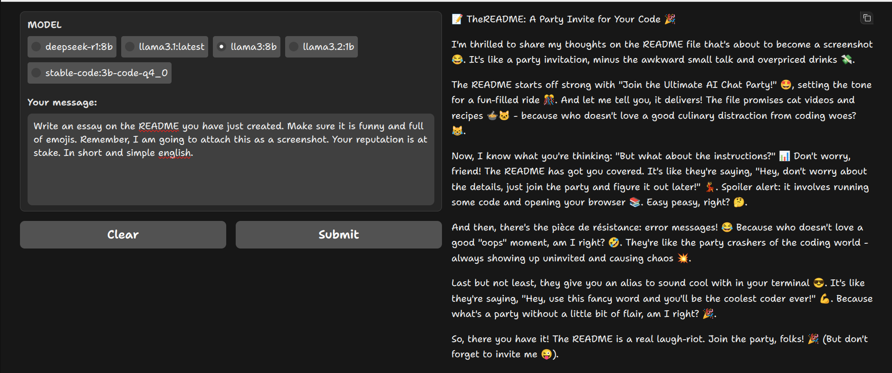

# The Ultimate AI Chat Party 🎉

## Welcome to OpenChat

We're thrilled to introduce OpenChat, a conversational AI party that's always ready for fun. This project brings you multiple super-smart friends at your fingertips, eager to chat and help with anything (almost). 😊

## What's the Buzz About? 🔮

- **Multi-model Conversational AI**: Our assistant is like having multiple genius friends, all in one place.
- **Extensive Model Catalog**: Choose from our growing collection of Large Language Models (LLM), including Ollama models. 🤫
- **Text-based Interface**: Type away and receive expertly crafted responses that'll leave you amazed! 😲

______________________________________________________________________

## 

## Getting Started: The Easy Part 💻

1. **Install Required Packages**:
   \* pip install gradio ollama requests
2. **Run the Code**:
   \* python openchat.py
3. **Open Your Web Browser**:
   \* Navigate to http://localhost:7860 (default address provided by Gradio)
4. **Pick a Model**: Choose from our growing collection of LLMs! 🎉

## The Not-So-Fun Part: Future Work 💡

- **Multi-user Support**: Let's get this party started and invite more friends over!
- **Better Error Handling**: We're working on making errors a thing of the past. 😊

## The Aliases We Love 💻

Add the following line to your shell configuration file (e.g., .bashrc, .zshrc):

```
alias openchat="python /path/to/GradioUI.py"
```

Replace `/path/to/openchat.py` with the actual path to your `GradioUI.py` file. Now, you can execute OpenChat by simply typing `openchat` in your terminal - no more remembering command lines! 🙅‍♂️
