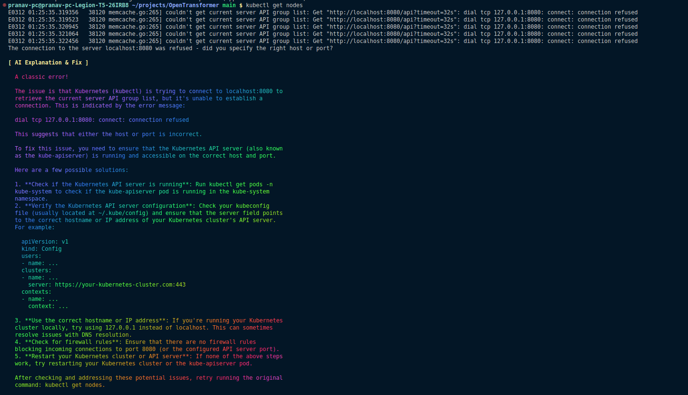
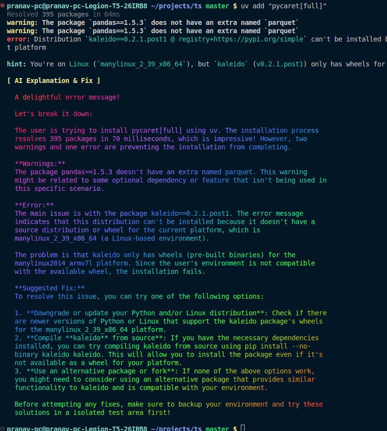

# AI Debugging Assistant

## Overview

This script automatically captures the last executed command in your shell (Bash or Zsh) and checks if it resulted in an error. If an error occurs, it queries a local AI model using Ollama to generate insights and suggestions for fixing the issue. The response is then displayed in a visually enhanced format using `glow` and `lolcat`.

## How it Works

1. **Capturing the Last Command**: The script captures the last executed command in your terminal (works with both Bash and Zsh).
2. **Error Detection**: It checks if the command resulted in an error by analyzing the exit code.
3. **Querying the AI Model**: If there’s an error, the script sends the failed command and error message to a local AI model (using Ollama) to provide insights and debugging suggestions.
4. **Displaying Results**: The AI response is formatted for easy reading using `glow` and `lolcat` and displayed in your terminal.
5. **Lock File Mechanism**: To prevent repeated API calls, the script uses a lock file to ensure only one request is made for the same error.


## Installation Steps

### 1. Install Ollama

Ollama is used to run the AI model locally. Install it using:

```sh
curl -fsSL https://ollama.ai/install.sh | sh
```

After installation, pull the required AI model (modify the model name as needed):

```sh
ollama pull llama3:8b
```

### 2. Install Required Dependencies

The script uses `glow` and `lolcat` for better formatting. Install them using Homebrew:

```sh
brew install glow
brew install lolcat
```

### 3. Configure Your Shell

For **Bash**, add the following line to your `~/.bashrc` or `~/.bash_profile`:

```sh


# Function to capture last command and check for errors
capture_last_command() {
    EXIT_CODE=$?
    LOCK_FILE=/tmp/curl_command_lock

    # Get last command (compatible with both Bash & Zsh)
    if [ -n "$ZSH_VERSION" ]; then
        LAST_CMD=$(fc -ln -1 | tail -n 1 | xargs)
    else
        LAST_CMD=$(history 1 | sed "s/^[ ]*[0-9]*[ ]*//" | xargs)
    fi

    # Skip if no command was entered
    if [ -z "$LAST_CMD" ]; then
        return 0
    fi

    # If last command was successful, remove lock file
    if [ $EXIT_CODE -eq 0 ]; then
        [ -f "$LOCK_FILE" ] && rm -f "$LOCK_FILE" && echo "Lock file removed due to successful command."
        return 0
    fi

    # Capture error output
    ERROR_MSG=$( { eval "$LAST_CMD"; } 2>&1 )

    # Escape special characters in JSON payload
    LAST_CMD_ESCAPED=$(echo "$LAST_CMD" | jq -Rsa .)
    ERROR_MSG_ESCAPED=$(echo "$ERROR_MSG" | jq -Rsa .)

    # echo "PROMPT_COMMAND executed with EXIT_CODE=$EXIT_CODE"
    # echo "Last Command: $LAST_CMD"
    # echo "Error Message: $ERROR_MSG"

    # Ensure the curl command runs only once
    if [ ! -f "$LOCK_FILE" ]; then
        touch "$LOCK_FILE"

        # Define the prompt for LLM
        PROMPT="You are an AI assistant helping debug errors.
A user ran the following command:

Command: $LAST_CMD
Error: $ERROR_MSG

Explain the error and suggest a fix."

        # Properly format JSON payload
        JSON_PAYLOAD=$(jq -n --arg model "llama3:8b" --arg prompt "$PROMPT" \
                            '{ "model": $model, "prompt": $prompt, "stream": false }')


        # # Print the curl command for debugging
        # echo -e "\n\033[1;34m[ DEBUG: CURL Command ]\033[0m"
        # echo "curl -s -X POST http://localhost:11434/api/generate -H \"Content-Type: application/json\" -d \"$JSON_PAYLOAD\""

        # # Call the LLM and print the raw response
        # echo -e "\n\033[1;34m[ DEBUG: Raw API Response ]\033[0m"
        RESPONSE=$(curl -s -X POST http://localhost:11434/api/generate \
            -H "Content-Type: application/json" \
            -d "$JSON_PAYLOAD")

        # echo "$RESPONSE"

        # RESPONSE_TEXT=$(echo "$RESPONSE" | jq -r .response | tr -d '\n' | sed 's/  */ /g')
        RESPONSE_TEXT=$(echo "$RESPONSE" | jq -r .response)


        echo -e "\n\033[1;33m[ AI Explanation & Fix ]\033[0m"
        echo "$RESPONSE_TEXT" | glow - | lolcat

        # Remove the lock file after the curl command finishes
        rm -f "$LOCK_FILE"
    else
        echo "Lock file exists, skipping curl command."
    fi
}

# Bash: Use PROMPT_COMMAND
if [ -n "$BASH_VERSION" ]; then
    export PROMPT_COMMAND="capture_last_command"

# Zsh: Use precmd
elif [ -n "$ZSH_VERSION" ]; then
    precmd() { capture_last_command; }
fi

```

For **Zsh**, add the following to your `~/.zshrc`:

```sh
precmd() { capture_last_command; }
```

Then, restart your terminal or source the file:

```sh
source ~/.bashrc  # For Bash
source ~/.zshrc   # For Zsh
```

## Example Screenshots

### EXample 1:



### Example 2:



## Credits

Developed by: **Me, Myself & ChatGPT - A legendary trio battling command-line errors one fix at a time!** 🚀😆
